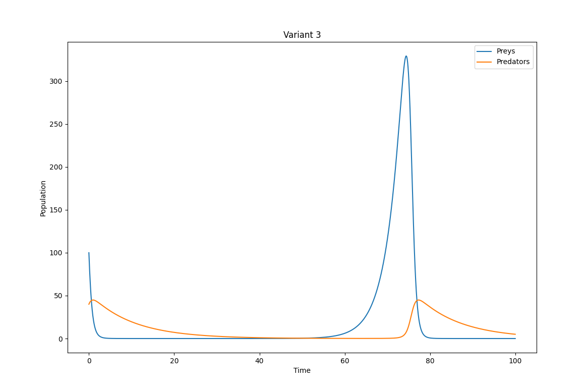
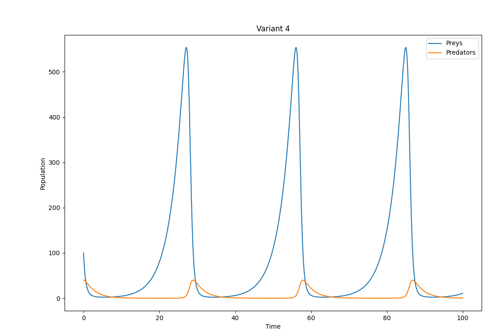
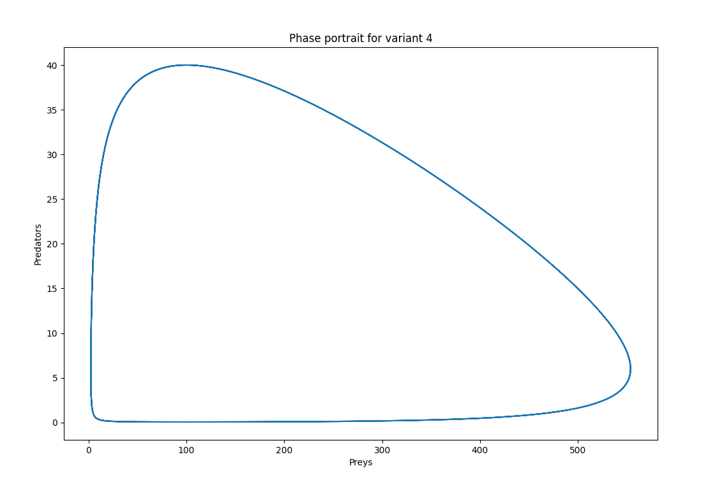

## Вхідні дані

### Варіант 3
- a = 0.04  
- b = 0.004  
- g = 0.3 
- s = 0.1  
- Початкові умови: X(0) = 100, Y(0) = 40

### Варіант 4
- a = 0.05 
- b = 0.004  
- g = 0.3 
- s = 0.4 
- Початкові умови: X(0) = 100, Y(0) = 40

### Стандартні параметри:
- tN = 100
- N = 4000

## Реалізація моделі Лотки-Вольтерри
```python 
def lotka_volterra(a:float,b:float,g:float,s:float, X0: int = 100, Y0: int = 40, t0: float = 0, tN: float = 100, N: int = 4000):

    def dx_dt(x,y): return g*x - a*x*y
        
    def dy_dt(x,y): return -s*y + b*x*y
        
    dt = (tN-t0) / N
    t = numpy.arange(t0,tN,dt)

    X, Y = (numpy.empty_like(t) for _ in range(2))
    X[0], Y[0] = X0, Y0

    for i in range(len(t)-1):
        k1x = dx_dt(X[i], Y[i])
        k1y = dy_dt(X[i],Y[i])

        k2x = dx_dt(X[i]+dt * k1x / 2, Y[i] + dt * k1y / 2)
        k2y = dy_dt(X[i]+dt * k1x / 2, Y[i] + dt * k1y / 2)

        k3x = dx_dt(X[i]+dt*k2x/2, Y[i]+dt*k2y/2)
        k3y = dy_dt(X[i]+dt*k2x/2, Y[i]+dt*k2y/2)

        k4x = dx_dt(X[i] + dt * k3x, Y[i] + dt * k3y)
        k4y = dy_dt(X[i] + dt * k3x, Y[i] + dt * k3y)

        X[i+1] = X[i] + dt * (k1x+2*k2x+2*k3x+k4x) / 6
        Y[i+1] = Y[i] + dt * (k1y+2*k2y+2*k3y+k4y) / 6

    return t,X,Y
```
## Візуалізація результатів

#### Динаміка зміни розміру популяцій хижаків та жертв:





#### Фазові простори:





