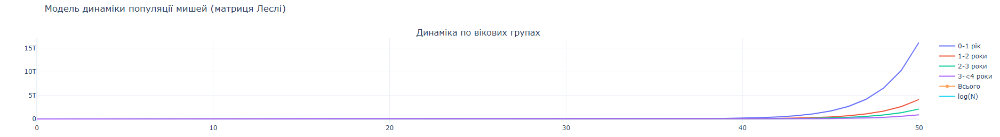
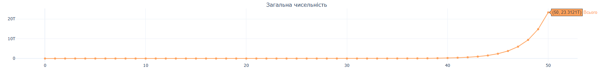
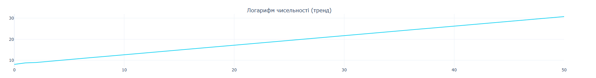

## Вхідні дані

### Варіант 2
- Початкова популяція: 900 (0 -> 1 років) + 630 (1 -> 2 роки) + 745 (2 -> 3 роки) + 910 (3 -> <4 роки)
- Народжуваність для відповідних вікових груп: 0.4 (0 -> 1 років),  2.6 (1 -> 2 роки), 3.8 (2 -> 3 роки), 0.4 (3 -> <4 роки)
- Виживання: 0.4 (0 -> 1 років) + 0.8 (1 -> 2 роки),  0.65 (2 -> 3 роки) + 0 (3 -> <4 роки)

## Реалізація моделі Леслі
```python 
years = 50

initial_population = np.array([900, 630, 745, 910])
birth_rates = np.array([0.4, 2.6, 3.8, 0.4])
survival_rates = np.array([0.4, 0.8, 0.65, 0.0])

# --------------------- Матриця Леслі ---------------------
leslie_matrix = np.array([
    birth_rates,
    [survival_rates[0], 0, 0, 0],
    [0, survival_rates[1], 0, 0],
    [0, 0, survival_rates[2], 0]
])

populations = [initial_population]
for t in range(1, years+1):
    next_population = leslie_matrix @ populations[-1]
    populations.append(next_population)

populations = np.array(populations)
total_population = populations.sum(axis=1)
log_population = np.log(total_population + 1)  # +1 щоб уникнути log(0)
age_labels = ["0-1 рік", "1-2 роки", "2-3 роки", "3-<4 роки"]
```

## Аналіз стійкості популяції та тренду на ознаку зростання
```python 
eigenvalues, _ = np.linalg.eig(leslie_matrix)
lambda_max = max(np.real(eigenvalues))

# Тренд через регресію log(N)
slope, intercept, r_value, p_value, std_err = linregress(range(len(log_population)), log_population)

print("========== АНАЛІЗ СТІЙКОСТІ ==========")
if lambda_max > 1:
    print(f"Популяція в довгостроковій перспективі зростає (λ = {lambda_max:.3f})")
elif lambda_max < 1:
    print(f"Популяція в довгостроковій перспективі зменшується (λ = {lambda_max:.3f})")
else:
    print(f"Популяція стабільна (λ = {lambda_max:.3f})")
print("========== АНАЛІЗ ТРЕНДУ НА ОЗНАКУ ЗРОСТАННЯ ==========")

if slope > 0:
    print(f"Тренд загальної чисельності → зростання (нахил = {slope:.3f})")
elif slope < 0:
    print(f"Тренд загальної чисельності → спадання (нахил = {slope:.3f})")
else:
    print("Тренд загальної чисельності стабільний")
```

### Візуалізація




## Результати
Візуалізувавши результати, та провівши аналіз, маємо:
- Популяція в довгостроковій перспективі зростає (λ = 1.573)
- Тренд загальної чисельності → зростання (нахил = 0.453) (можна побачити на графіку тренду)
- Наприкінці спостереження загальна популяція складає близько 23 трильйонів, серед яких більшість - це представники вікової категорії 0-1 років