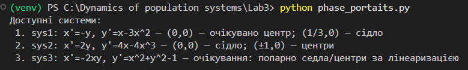
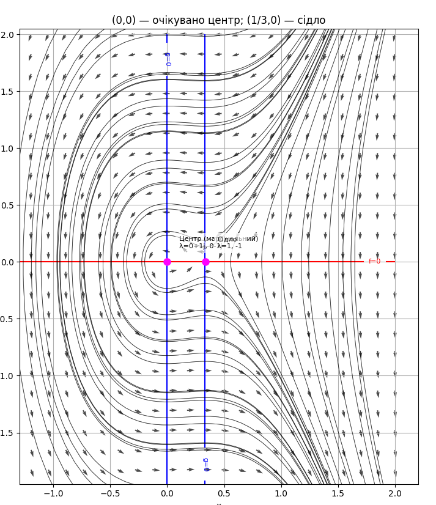
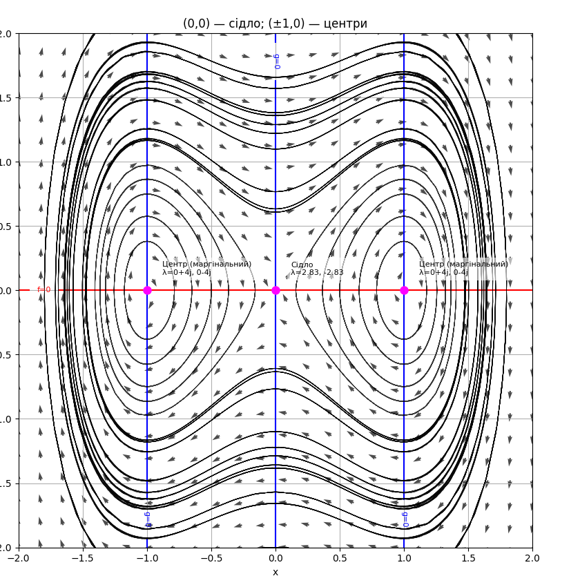
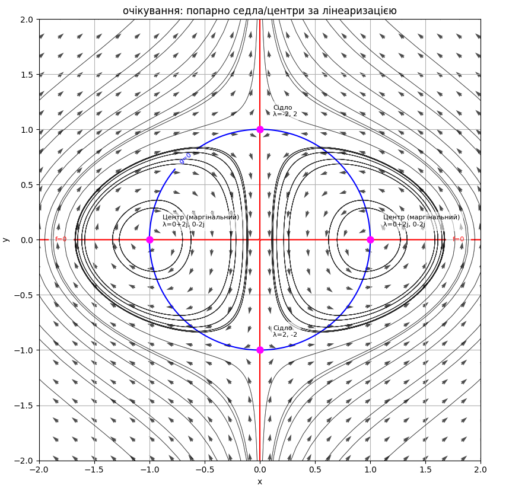

# Лабораторна №3 — Фазові портрети

Мета: дослідити особливі точки автономних систем ODE на площині, класифікувати їх за лінеаризацією та побудувати фазові портрети (векторне поле, нульові ізокліни, інтегральні криві).

## Постановка завдання
1) Для кожної системи знайти точки рівноваги (f=0, g=0).
2) Обчислити матрицю Якобіана J(x,y) і власні значення у рівновагах.
3) Класифікувати типи: вузол/сідло/фокус/центр.
4) Побудувати фазовий портрет і звірити з аналітичним розбором.

## Приклади з розв'язками (plain text)

### Приклад 1
Система: `x' = -y`, `y' = x - 3x^2`

**Рівноваги.** y=0; x-3x^2=0 ⇒ x∈{0, 1/3} ⇒ точки (0,0) та (1/3,0).

**Якобіан.** `J(x,y) = [[0, -1], [1 - 6x, 0]]`
- У (0,0): власні значення λ = ± i ⇒ **центр** (маргінальна стійкість).
- У (1/3,0): λ = ± 1 ⇒ **сідло** (сепаратриси зі схилами ±1).

### Приклад 2
Система: `x' = 2y`, `y' = 4x − 4x^3`

**Рівноваги.** y=0; 4x(1−x^2)=0 ⇒ x∈{0, ±1} ⇒ (0,0), (1,0), (−1,0).

**Якобіан.** `J(x,y) = [[0, 2], [4 − 12x^2, 0]]`
- У (0,0): λ = ± 2√2 ⇒ **сідло**.
- У (±1,0): λ = ± 4i ⇒ **центри**.

### Приклад 3
Система: `x' = −2xy`, `y' = x^2 + y^2 − 1`

**Рівноваги.** Вимоги: `xy=0` та `x^2 + y^2 = 1` ⇒ точки (±1,0), (0,±1).

**Якобіан.** `J(x,y) = [[−2y, −2x], [2x, 2y]]`
- У (0,±1): λ = {−2, 2} ⇒ **сидла** (сепаратриси вздовж осей).
- У (±1,0): λ = ± 2i ⇒ **центри**.

**Геометрія.** Ізокліни: `g=0` — коло `x^2+y^2=1`; `f=0` — осі `x=0` та `y=0`.

## Приклад 1

## Приклад 2

## Приклад 3
