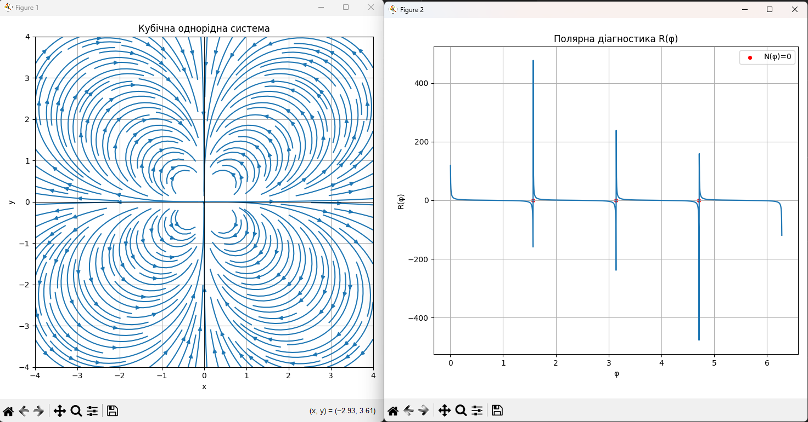
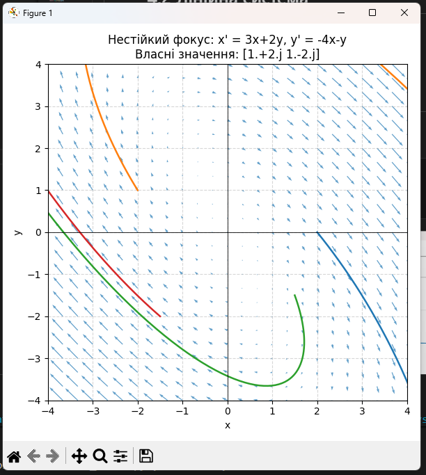

# Лабораторна робота №4

## 4.1 Однорідна система

dx/dt = P(x, y)  
dy/dt = Q(x, y)

P & Q - однорідні функції одного степеня  

## 4.2 Лінійна система

dx/dt = ax + by  
dy/dt = cx + dy

## Приклади для систем
4.1. Однорідна система 
    
    P(x,y) = x^3 - 3xy^2  
    Q(x,y) = 3x^2y - y^3

Як результат, отримали сідло в точці O(0,0).

4.2 Лінійна система

    dx/dt = 3x+2y
    dy/dt = -4x-y
    

Як результат, точка О(0,0) - нестійкий фокус, траєкторії спірально розходяться від точки

